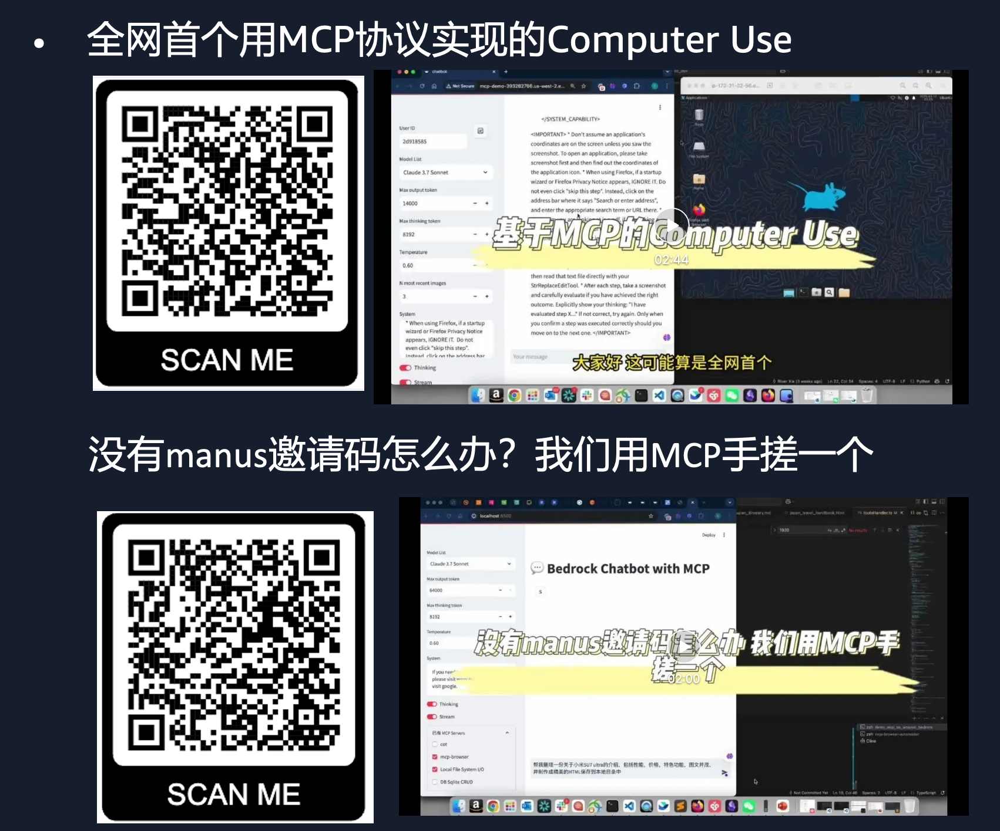
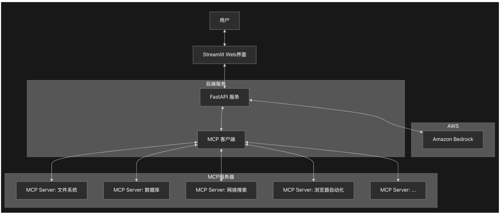
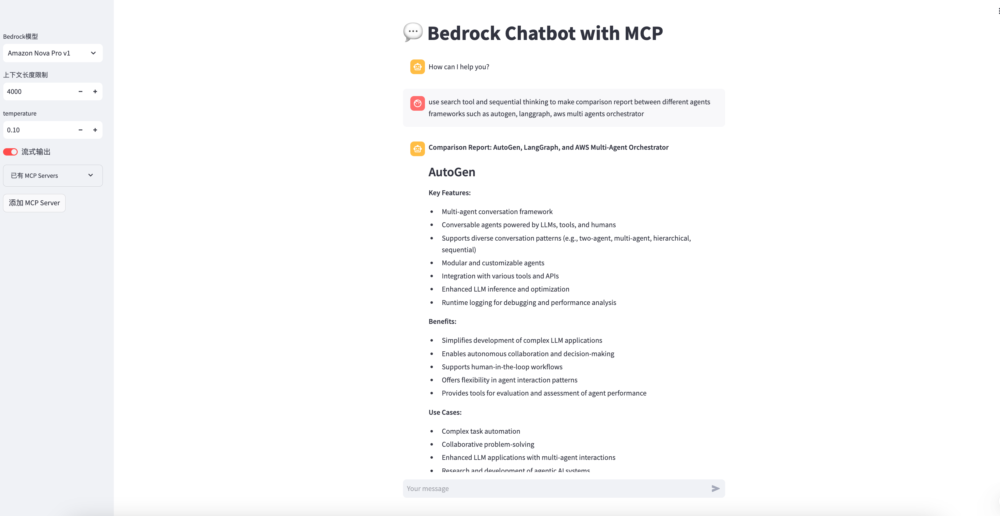
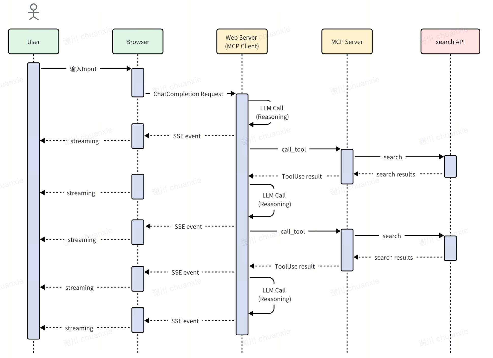

# MCP on Amazon Bedrock
- Demo Vides


> ChatBot is the most common application form in the era of large language models, but it is limited by the model's inability to access real-time information or operate external systems, which restricts its application scenarios. With the introduction of Function Calling/Tool Use capabilities, large models can now interact with external systems, but the drawback is that the business logic and tool development are tightly coupled, preventing efficient scaling on the tool side. In late November 2024, Anthropic introduced [MCP](https://www.anthropic.com/news/model-context-protocol), breaking this limitation by leveraging the entire community's power to scale up on the tool side. Currently, the open-source community and various vendors have developed rich [MCP servers](https://github.com/modelcontextprotocol/servers), enabling the tool ecosystem to flourish. End users can integrate these tools into their ChatBots with plug-and-play simplicity, greatly extending ChatBot UI capabilities, trending toward ChatBots unifying various system interfaces.

- How MCP Works


- Enterprise Architecture Design Based on AWS


- This project provides ChatBot interaction services based on large models like Nova and Claude in **Bedrock**, while introducing **MCP** to greatly enhance and extend the application scenarios of ChatBot-style products, supporting seamless integration with local file systems, databases, development tools, internet search, and more. If a ChatBot with large models is comparable to a brain, then introducing MCP is like adding arms and legs, truly enabling the large model to move and connect with various existing systems and data.

- **Demo Solution Architecture**


- **Core Components**

   1. MCP Client (mcp_client.py)
      - Manages connections to multiple MCP servers
      - Handles tool calls and resource access
      - Provides tool name mapping and normalization functions
   2. Chat Client (chat_client.py, chat_client_stream.py)
      - Interacts with Amazon Bedrock API
      - Processes user queries and model responses
      - Supports streaming responses and tool calls
   3. Main Service (main.py)
      - Provides FastAPI service exposing chat and MCP management APIs
      - Manages user sessions and MCP server configurations
      - Handles concurrent requests and resource cleanup
   4. Web Interface (chatbot.py)
      - Streamlit-based user interface
      - Allows users to interact with models and manage MCP servers
      - Displays tool call results and reasoning processes

- **Technical Architecture**
   1. Frontend-Backend Separation
      - Backend: FastAPI service providing REST API
      - Frontend: Streamlit web interface
   2. Multi-user Support
      - User session isolation
      - Support for concurrent access
   3. MCP Server Management
      - Support for dynamically adding and removing MCP servers
      - Global and user-specific MCP server configurations

- **Workflow**

   1. User sends query through web interface
   2. Backend service receives query and forwards to Bedrock model
   3. If model needs to use tools, MCP client calls appropriate MCP servers
   4. Tool call results return to model, which generates final response
   5. Response returns to user, including tool call process and results

- This project is continuously evolving, and MCP is flourishing throughout the community. Everyone is welcome to follow along!

## 1. Project Features:
   - Supports both Amazon Nova Pro and Claude Sonnet models
   - Fully compatible with Anthropic's official MCP standard, allowing direct use of various [MCP servers](https://github.com/modelcontextprotocol/servers/tree/main) from the community
   - Decouples MCP capabilities from the client, encapsulating MCP functionality on the server side and providing API services with OpenAI-compatible chat interfaces for easy integration with other chat clients
    
   - Frontend-backend separation, with MCP Client and MCP Server deployable on the server side, allowing users to interact directly through a web browser via the backend web service to access LLM and MCP Server capabilities and resources
   - Supports multiple users with session isolation and concurrent access
   - Streaming responses
   - Visualization of reasoning processes
   - Display of tool call results and Computer Use screenshots

## 2. Installation Steps
### 2.1. Dependencies

Currently, mainstream MCP Servers are developed using NodeJS or Python and run on users' PCs, so these dependencies need to be installed.

### 2.1 NodeJS

[Download and install](https://nodejs.org/en) NodeJS. This project has been thoroughly tested with `v22.12.0`.

### 2.2 Python

Some MCP Servers are developed in Python, so users must install [Python](https://www.python.org/downloads/). Additionally, this project's code is developed in Python and requires environment and dependency installation.

First, install the Python package management tool uv by following the [uv](https://docs.astral.sh/uv/getting-started/installation/) official guide. This project has been thoroughly tested with `v0.5.11`.

### 2.3 Environment Configuration
After downloading and cloning the project, enter the project directory to create a Python virtual environment and install dependencies:
```bash
uv sync
```

This creates a virtual environment in the `.venv` directory of the project. Activate it with:
```
source .venv/bin/activate
```

### 2.4 Configuration Editing
> Tips: If you need to configure multiple account ak/sk using a polling mechanism, you can add a `credential.csv` in the conf/ directory with columns **ak** and **sk**, and fill in multiple ak/sk pairs, for example:

| ak | sk |
| ----- | ----- |
| ak 1 | sk 1 |
| ak 2 | sk 2 |

Project configuration should be written to the `.env` file and include the following items (it's recommended to copy `env_dev` and modify it):
```
AWS_ACCESS_KEY_ID=(optional, not needed if credential.csv exists)<your-access-key>
AWS_SECRET_ACCESS_KEY=(optional)<your-secret-key>
AWS_REGION=<your-region>
LOG_DIR=./logs
CHATBOT_SERVICE_PORT=<chatbot-ui-service-port>
MCP_SERVICE_HOST=127.0.0.1
MCP_SERVICE_PORT=<bedrock-mcp-service-port>
API_KEY=<your-new-api-key>
MAX_TURNS=100
```

Note: This project uses **AWS Bedrock Nova/Claude** series models, so you need to register and obtain access keys for these services.

## 3. Running

### 3.1 This project includes a backend service and a Streamlit frontend, connected via REST API:
- **Chat Interface Service (Bedrock+MCP)**: Provides Chat API, hosts multiple MCP servers, supports multi-turn conversation history input, includes tool call intermediate results in responses, but doesn't support streaming responses yet
- **ChatBot UI**: Communicates with the Chat interface service, providing multi-turn conversation and MCP management through a web UI demonstration service

### 3.2 Chat Interface Service (Bedrock+MCP)
- The interface service can provide independent APIs for other chat clients, decoupling server-side MCP capabilities from clients
- API documentation can be viewed at http://{ip}:7002/docs#/


- Edit the configuration file `conf/config.json`, which presets which MCP servers to start. You can edit it to add or modify MCP server parameters.
- For each MCP server's parameter specifications, refer to the following example:
```
"db_sqlite": {
    "command": "uvx",
    "args": ["mcp-server-sqlite", "--db-path", "./tmp/test.db"],
    "env": {},
    "description": "DB Sqlite CRUD - MCP Server",
    "status": 1
}
```

- Start the service:
```bash
bash start_all.sh
```

- Stop the service:
```bash
bash stop_all.sh
```

- After startup, check the log `logs/start_mcp.log` to confirm there are no errors, then run the test script to check the Chat interface:
```bash
# This script uses Bedrock's Amazon Nova-lite model, which can be changed
# Default API key is 123456, please change according to your actual settings
curl http://127.0.0.1:7002/v1/chat/completions \
  -H "Content-Type: application/json" \
  -H "Authorization: Bearer 123456" \
  -H "X-User-ID: user123" \
  -d '{
    "model": "us.amazon.nova-pro-v1:0",
    "mcp_server_ids":["local_fs"],
    "stream":true,
    "messages": [
      {
        "role": "user",
        "content": "list files in current dir"
      }
    ]
  }'
```

### 3.3 UI
#### (🚀 New) React UI
- 🚀 Modern frontend built with Next.js 14 and React 18, supporting Dark/Light modes
- 🎨 Beautiful user interface using Tailwind CSS and Shadcn UI component library
- 🔄 Real-time streaming responses for smooth conversation experience
- 🧠 "Thinking" mode support to display the model's reasoning process
- 🛠️ MCP server management functionality for adding and configuring servers
- 👤 User session management to maintain conversation context
- 📊 Visualization of tool use results, including image display
- 📱 Responsive design adapting to various device sizes
- [Installation Steps](react_ui/README.md)


#### ChatBot UI 
After startup, check the log `logs/start_chatbot.log` to confirm there are no errors, then open [the service address](http://localhost:8502/) in a browser to experience the enhanced Bedrock large model ChatBot capabilities with MCP.
Since file system operations, SQLite database, and other MCP Servers are already built in, you can try asking the following questions consecutively:

```
show all of tables in the db
how many rows in that table
show all of rows in that table
save those rows record into a file, filename is rows.txt
list all of files in the allowed directory
read the content of rows.txt file
```

### 3.4. Adding MCP Servers
Currently, there are two ways to add MCP Servers:
1. Preset in `conf/config.json`, which loads configured MCP Servers each time the Chat interface service restarts
2. Add MCP Servers through the ChatBot UI by submitting MCP Server parameters via form, which only takes effect for the current session and is lost after service restart

Below is a demonstration of how to add an MCP Server through the ChatBot UI, using [Exa](https://exa.ai/) web search provider as an example. The open-source community already has a usable [MCP Server](https://github.com/exa-labs/exa-mcp-server) for it.

First, go to the [Exa](https://exa.ai/) website to register an account and obtain an API Key.
Then click [Add MCP Server], and fill in the following parameters in the popup menu:

- Method 1: Directly add MCP JSON configuration file (same format as Anthropic official format)
```json
{
  "mcpServers": {
    "exa": {
      "command": "npx",
      "args": ["-y","exa-mcp-server"],
      "env": {
        "EXA_API_KEY": "your-api-key-here"
      }
    }
  }
}
```
- Method 2: Add by fields

Now you can see the newly added item in the existing MCP Server list. Check it to start this MCP Server.

## 4. CDK Installation (New)
[README](cdk/README.me)

## 5 Demo Cases
### 5.1. Using MCP to Operate Browser
- Add this JSON file in the chatbot interface. Note: This [browser use](https://github.com/vinayak-mehta/mcp-browser-use) server starts the browser in headed mode by default, so it's suitable for demos deployed on local computers. If deployed on a server, please add "use headless is true to initialize the browser" in your prompt.
```json
{ "mcpServers": 
	{ "mcp-browser": 
		{ "command": "uvx", 
        "args": ["mcp-browser-use"],
        "env": {},
        "description": "mcp-browser"
		} 
	} 
}
```
**Notice** When you run it first time, you might need to install dependencies in your server via `sudo apt-get install libgbm1`  


- Test 1: In the chatbot interface, check both mcp-browser and local file system servers.
Input task: `Help me create a comprehensive introduction about Xiaomi SU7 Ultra, including performance, price, special features, with rich text and images, and save it as a beautiful HTML file in the local directory. If you reference images from other websites, ensure the images actually exist and are accessible.`
[Video demo](https://mp.weixin.qq.com/s/csg7N8SHoIR2WBgFOjpm6A)
[Final output file example](docs/xiaomi_su7_ultra_intro.html)
  - If running for the first time, you may need to install additional software. Please follow the installation prompts returned by the tool call.

- Test 2: In the chatbot interface, check exa, mcp-browser, and local file system (3 servers). This will combine search engines and browsers to gather information and images, creating a richer report.
Input task: `I want a comprehensive analysis of Tesla stock, including: Overview: company profile, key metrics, performance data, and investment recommendations. Financial data: revenue trends, profit margins, balance sheet, and cash flow analysis. Market sentiment: analyst ratings, sentiment indicators, and news impact. Technical analysis: price trends, technical indicators, and support/resistance levels. Asset comparison: market share and financial metrics compared to major competitors. Value investors: intrinsic value, growth potential, and risk factors. Investment thesis: SWOT analysis and recommendations for different types of investors. Create this as a beautiful HTML file saved to the local directory. If you reference images from other websites, ensure the images actually exist and are accessible. You can use mcp-browser and exa search to gather as much real-time data and images as possible.`
[Final output file example](docs/tesla_stock_analysis.html)

- **Sequence Diagram 1: Using Headless Browser MCP Server**


### 5.2 Using MCP Computer Use to Operate EC2 Remote Desktop
- In another directory, install and download remote-computer-use:
```bash
git clone https://github.com/aws-samples/aws-mcp-servers-samples.git
```
- You need to set up an EC2 instance with VNC remote desktop configured in advance. For installation steps, please refer to [instructions](https://github.com/aws-samples/aws-mcp-servers-samples/blob/main/remote_computer_use/README.md)
- After setting up the environment, configure the MCP demo client as follows:
```json
{
    "mcpServers": {
        "computer_use": {
            "command": "uv",
            "env": {
                "VNC_HOST":"",
                "VNC_PORT":"5901",
                "VNC_USERNAME":"ubuntu",
                "VNC_PASSWORD":"",
                "PEM_FILE":"",
                "SSH_PORT":"22",
                "DISPLAY_NUM":"1"
            },
            "args": [
                "--directory",
                "/absolute_path_to/remote_computer_use",
                "run",
                "server_claude.py"
            ]
        }
    }
}
```
- For Computer Use, the Claude 3.7 model is recommended, with the following system prompt:

```plaintext
You are an expert research assistant with deep analytical skills. When presented with a task, follow this structured approach:

<GUIDANCE>
  1. First, carefully analyze the user's task to understand its requirements and scope.
  2. Create a comprehensive research plan organized as a detailed todo list following this specific format:

    ```markdown
    # [Brief Descriptive Title]

    ## Phases
    1. **[Phase Name 1]**
        - [ ] Task 1
        - [ ] Task 2
        - [ ] Task 3

    2. **[Phase Name 2]**
        - [ ] Task 1
        - [ ] Task 2
    ```

  3. As you progress, update the todo list by:
    - Marking completed tasks with [x] instead of [ ]
    - Striking through unnecessary tasks using ~~text~~ markdown syntax

  4. Save this document to the working directory `/home/ubuntu/Documents/` as `todo_list_[brief_descriptive_title].md` using the available file system tools.
  5. Execute the plan methodically, addressing each phase in sequence.
  6. Continuously evaluate progress, update task status, and refine the plan as needed based on findings.
  7. Provide clear, well-organized results that directly address the user's original request.
</GUIDANCE>

<IMPORTANT>
  * Don't assume an application's coordinates are on the screen unless you saw the screenshot. To open an application, please take screenshot first and then find out the coordinates of the application icon. 
  * When using Firefox, if a startup wizard or Firefox Privacy Notice appears, IGNORE IT.  Do not even click "skip this step".  Instead, click on the address bar where it says "Search or enter address", and enter the appropriate search term or URL there. Maximize the Firefox browser window to get wider vision.
  * If the item you are looking at is a pdf, if after taking a single screenshot of the pdf it seems that you want to read the entire document instead of trying to continue to read the pdf from your screenshots + navigation, determine the URL, use curl to download the pdf, install and use pdftotext to convert it to a text file, and then read that text file directly with your StrReplaceEditTool.
  * After each step, take a screenshot and carefully evaluate if you have achieved the right outcome. Explicitly show your thinking: "I have evaluated step X..." If not correct, try again. Only when you confirm a step was executed correctly should you move on to the next one.
</IMPORTANT>
```

- **Sequence Diagram: Using Computer Use to Operate EC2 Remote Desktop**


### 5.3. Using Sequential Thinking + Search for Deep Research (mainly for Nova/Claude 3.5 models, Claude 3.7 doesn't need this)
- Enable both websearch (refer to the EXA configuration above) and [Sequential Thinking MCP Server](https://github.com/modelcontextprotocol/servers/tree/main/src/sequentialthinking). Sequential Thinking MCP Server is already preset in the configuration file, and after startup, you can see the server name is "cot".

- Sequential Thinking provides structured reasoning chains through dynamic structured thinking processes and reflection, prompting the model to output structured reasoning chains according to tool input requirements.
- EXA Search provides both keyword and vector search for network knowledge, returning detailed content from web pages.
- Test questions:
```
1. use search tool and sequential thinking to make comparison report between different agents frameworks such as autogen, langgraph, aws multi agents orchestrator
2. use sequential thinking and search tool to make me a travel plan to visit shanghai between 3/1/2025 to 3/5/2025. I will departure from Beijing
3. use sequential thinking to research what the key breakthroughs and future impact of deepseek r1
4. 搜索对比火山引擎，阿里百炼，硅基流动上的对外提供的deepseek r1 满血版的API 性能对比, 包括推理速度，TTFT， 最大context长度等。使用sequential thinking 工具
```
- Results preview:



- **Sequence Diagram: Using Search API MCP Server**


### 5.3. Using Amazon Knowledge Base
First, create or use an existing Knowledge Base in the Bedrock console and note down the Knowledge Base Id.
Clone [AWS Knowledge Base Retrieval MCP Server](https://github.com/modelcontextprotocol/servers) locally, and replace the file in `src/aws-kb-retrieval-server/index.ts` with the file from [assets/aws-kb-retrieval-server/index.ts](assets/aws-kb-retrieval-server/index.ts).
> The new file specifies knowledgeBaseId through an environment variable, so it doesn't need to be passed through dialogue.

In the newly cloned servers directory, package it with the following command:
```sh
docker build -t mcp/aws-kb-retrieval:latest -f src/aws-kb-retrieval-server/Dockerfile . 
```

Then add this JSON file in the chatbot interface, making sure to replace the fields in env with your account information and Knowledge Base Id:
```json
{
  "mcpServers": {
    "aws-kb-retrieval": {
      "command": "docker",
      "args": [ "run", "-i", "--rm", "-e", "AWS_ACCESS_KEY_ID", "-e", "AWS_SECRET_ACCESS_KEY", "-e", "AWS_REGION", "-e", "knowledgeBaseId", "mcp/aws-kb-retrieval:latest" ],
      "env": {
        "AWS_ACCESS_KEY_ID": "YOUR_ACCESS_KEY_HERE",
        "AWS_SECRET_ACCESS_KEY": "YOUR_SECRET_ACCESS_KEY_HERE",
        "AWS_REGION": "YOUR_AWS_REGION_HERE",
        "knowledgeBaseId":"The knowledage base id"
      }
    }
  }
}
```

## 6. Awesome MCPs
- AWS MCP Servers Samples https://github.com/aws-samples/aws-mcp-servers-samples
- https://github.com/punkpeye/awesome-mcp-servers
- https://github.com/modelcontextprotocol/servers
- https://www.aimcp.info/en
- https://github.com/cline/mcp-marketplace
- https://github.com/xiehust/sample-mcp-servers
- https://mcp.composio.dev/
- https://smithery.ai/
- https://mcp.so/

## 9. [LICENSE](./LICENSE)