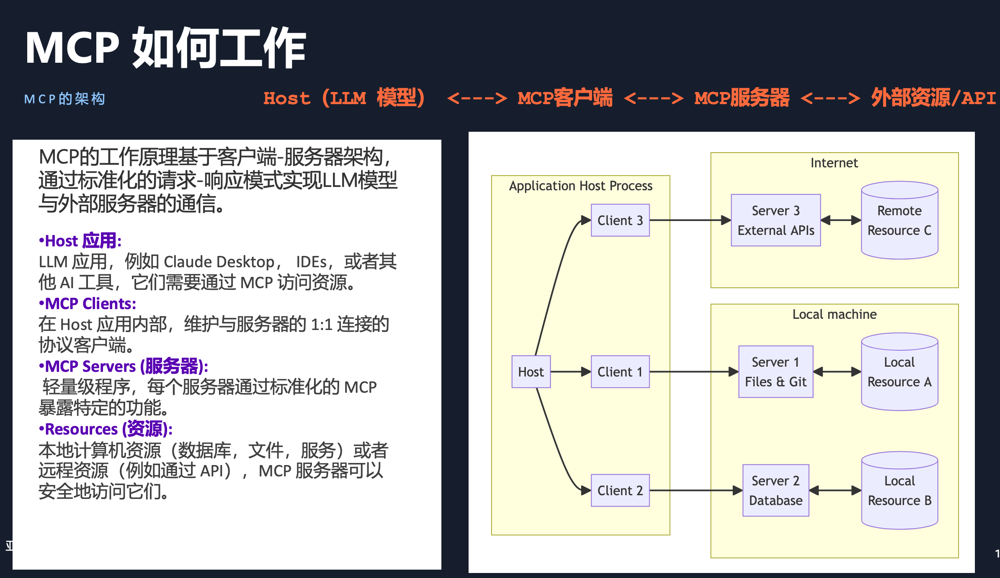
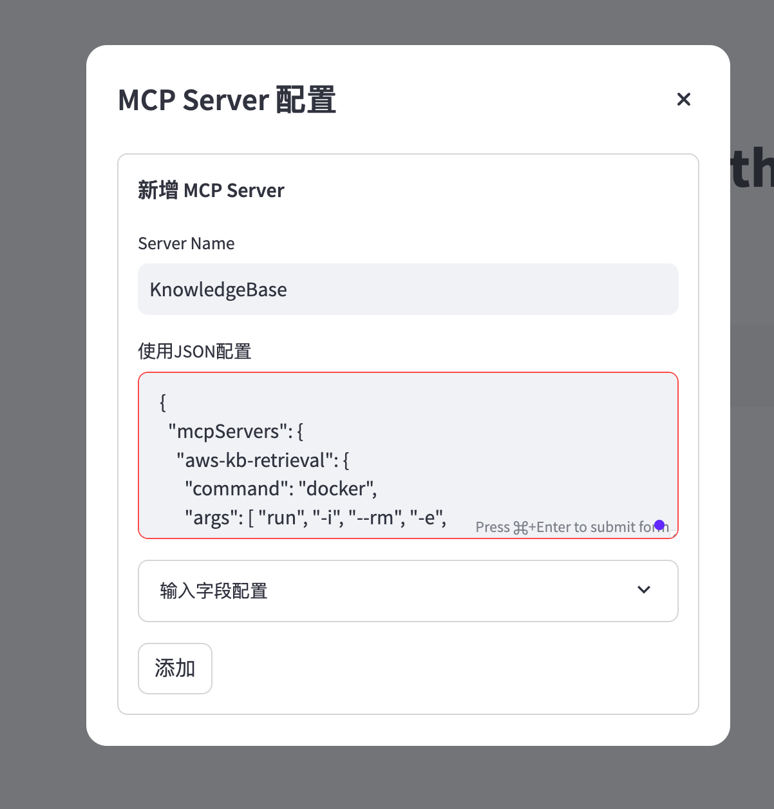
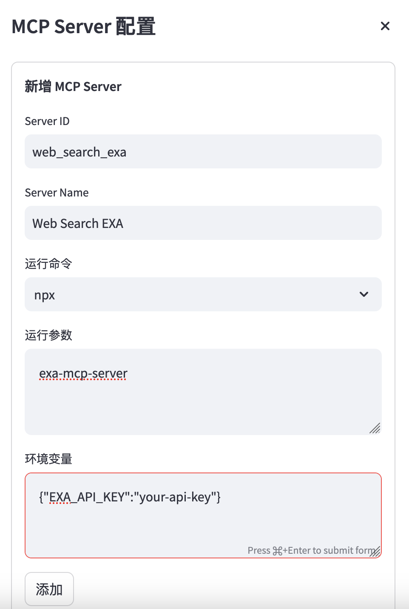
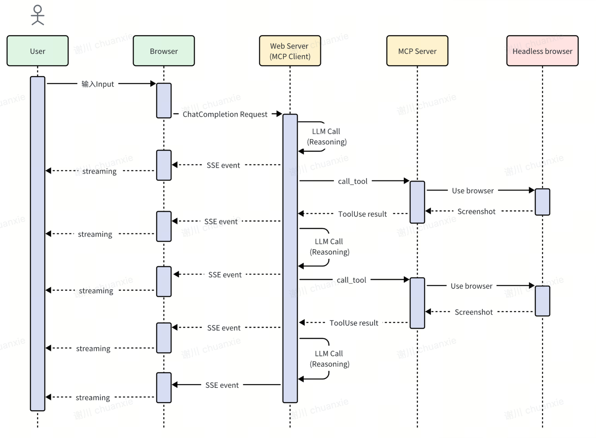

# MCP on Amazon Bedrock

> ChatBot is the most common application form in the large model era, but it is limited by the large model's inability to access timely information and operate external systems, making ChatBot application scenarios relatively limited. Later, with the introduction of Function Calling/Tool Use functionality, large models could interact with external systems, but the disadvantage was that the large model's business logic and Tool development were tightly coupled, unable to leverage the efficiency of scale on the Tool side. Anthropic broke this situation in late November 2024 with the introduction of [MCP](https://www.anthropic.com/news/model-context-protocol), bringing in the entire community's power to scale up on the Tool side. Currently, the open-source community and various vendors have developed rich [MCP servers](https://github.com/modelcontextprotocol/servers), enabling the Tool side to flourish. End users can plug and play to integrate them into their ChatBots, greatly extending the capabilities of ChatBot UI, with a trend of ChatBot unifying various system UIs.

- How MCP Works


- AWS-based MCP Enterprise Architecture Design Approach


- This project provides ChatBot interaction services based on Nova, Claude, and other large models in **Bedrock**, while introducing **MCP**, greatly enhancing and extending the application scenarios of ChatBot-form products, supporting seamless integration with local file systems, databases, development tools, internet retrieval, etc. If a ChatBot with a large model is equivalent to a brain, then introducing MCP is like equipping it with arms and legs, truly making the large model move and connect with various existing systems and data.

- Demo Solution Architecture


This project is still being continuously explored and improved, and MCP is flourishing throughout the community. Everyone is welcome to follow along!

## 1. Project Features:
- Supports both Amazon Nova Pro and Claude Sonnet3.5 models
- Fully compatible with Anthropic's official MCP standard, allowing direct use of various [MCP servers](https://github.com/modelcontextprotocol/servers/tree/main) from the community in the same way
- Decouples MCP capabilities from the client, encapsulating MCP capabilities on the server side, providing API services externally, and with chat interfaces compatible with OpenAI for easy integration with other chat clients

- Front-end and back-end separation, both MCP Client and MCP Server can be deployed on the server side, allowing users to interact directly through the backend web service via web browsers, thereby accessing LLM and MCP Server capabilities and resources
- Supports multiple users, user session isolation, and concurrent access.

## 2. Installation Steps
### 2.1. Dependencies Installation

Currently, mainstream MCP Servers are developed and run on users' PCs based on NodeJS or Python, so users' PCs need to install these dependencies.

### 2.1 NodeJS

[Download and install](https://nodejs.org/en) NodeJS, this project has been thoroughly tested with version `v22.12.0`.

### 2.2 Python

Some MCP Servers are developed based on Python, so users must install [Python](https://www.python.org/downloads/). Additionally, this project's code is also developed based on Python, requiring environment and dependency installation.

First, install the Python package management tool uv, which can be referenced in the [uv](https://docs.astral.sh/uv/getting-started/installation/) official guide. This project has been thoroughly tested with version `v0.5.11`.

### 2.3 Environment Configuration
After downloading and cloning the project, enter the project directory to create a Python virtual environment and install dependencies:
```bash
uv sync
```

At this point, the virtual environment has been created in the `.venv` directory of the project, activate it:
```
source .venv/bin/activate
```

### 2.4 Configuration Editing
Project configuration is written to the `.env` file, which should include the following configuration items (it is recommended to copy `env_dev` and modify it):
```
AWS_ACCESS_KEY_ID=(optional)<your-access-key>
AWS_SECRET_ACCESS_KEY=(optional)<your-secret-key>
AWS_REGION=<your-region>
LOG_DIR=./logs
CHATBOT_SERVICE_PORT=<chatbot-ui-service-port>
MCP_SERVICE_HOST=127.0.0.1
MCP_SERVICE_PORT=<bedrock-mcp-service-port>
API_KEY=<your-new-api-key>
MAX_TURNS=100
```

Note: This project uses **AWS Bedrock Nova/Claude** series models, so you need to register and obtain access keys for these services.

## 3. Running

### 3.1 This project includes 1 backend service and a Streamlit frontend, with front and back ends connected via REST API:
- **Chat Interface Service (Bedrock+MCP)**, which can provide Chat interfaces externally, host multiple MCP servers, support historical multi-turn conversation input, and response content with tool call intermediate results attached. Currently does not support streaming responses.
- **ChatBot UI**, which communicates with the above Chat interface service, providing multi-turn conversations and MCP management Web UI demonstration services.

### 3.2 Chat Interface Service (Bedrock+MCP)
- The interface service can provide independent APIs externally for integration with other chat clients, achieving decoupling of server-side MCP capabilities and clients.
- You can view the API documentation at http://{ip}:7002/docs#/.


- Edit the configuration file `conf/config.json`, which preset which MCP servers to start. You can edit it to add or modify MCP server parameters.
- For the parameter specifications of each MCP server, refer to the following example:
```
"db_sqlite": {
    "command": "uvx",
    "args": ["mcp-server-sqlite", "--db-path", "./tmp/test.db"],
    "env": {},
    "description": "DB Sqlite CRUD - MCP Server",
    "status": 1
}
```

- Start the service:
```bash
bash start_all.sh
```

- Stop the service:
```bash
bash stop_all.sh
```

- After startup, check the log `logs/start_mcp.log` to confirm there are no errors, then run the test script to check the Chat interface:
```bash
# The script uses Bedrock's Amazon Nova-lite model, which can be changed to others
# Default API key is 123456, please change according to your actual settings
curl http://127.0.0.1:7002/v1/chat/completions \
  -H "Content-Type: application/json" \
  -H "Authorization: Bearer 123456" \
  -H "X-User-ID: user123" \
  -d '{
    "model": "us.amazon.nova-pro-v1:0",
    "mcp_server_ids":["local_fs"],
    "stream":true,
    "messages": [
      {
        "role": "user",
        "content": "list files in current dir"
      }
    ]
  }'
```

### 3.3 ChatBot UI 
After startup, check the log `logs/start_chatbot.log` to confirm there are no errors, then open the [service address](http://localhost:8502/) in a browser to experience the enhanced Bedrock large model ChatBot capabilities with MCP.
Since file system operations, SQLite database, and other MCP Servers are already built-in, you can try asking the following questions consecutively for experience:

```
show all of tables in the db
how many rows in that table
show all of rows in that table
save those rows record into a file, filename is rows.txt
list all of files in the allowed directory
read the content of rows.txt file
```

### 3.4. Adding MCP Servers
Currently, there are two ways to add MCP Servers:
1. Preset in `conf/config.json`, which will load the configured MCP Servers each time the Chat interface service is restarted
2. Add MCP Servers through the ChatBot UI by submitting MCP Server parameters via a form, which is only effective for the current session and will be lost after service restart

Below is a demonstration of how to add an MCP Server through the ChatBot UI, using the Web Search provider [Exa](https://exa.ai/) as an example. The open-source community already has a [MCP Server](https://github.com/exa-labs/exa-mcp-server) available for it.

First, go to the [Exa](https://exa.ai/) official website to register an account and obtain an API Key.
Then click [Add MCP Server], and fill in the following parameters in the pop-up menu and submit:

- Method 1: Directly add MCP JSON configuration file (same format as Anthropic official)

```json
{
  "mcpServers": {
    "exa": {
      "command": "npx",
      "args": ["-y","exa-mcp-server"],
      "env": {
        "EXA_API_KEY": "your-api-key-here"
      }
    }
  }
}
```
- Method 2: Add by fields


Now you can see the newly added item in the list of existing MCP Servers, check it to start the MCP Server.

## 4. CDK Installation (New)
[README](cdk/README.me)

## 5 Demo Cases
### 5.1. Using MCP to Operate Browser 
- First install MCP-browser. Note: If deploying this demo locally, you can visually see the browser running automatically. If deploying on a server, you need to modify it to headless browser mode.
Download in a directory:
```bash
git clone https://github.com/xiehust/mcp-browser-automation.git
cd mcp-browser-automation
# Compile and install using npm commands
npm install
npm install @playwright/test
npx playwright install 
```
- Note for server deployment, you need to modify to headless browser mode by changing headless:true in mcp-browser-automation/src/toolsHandler.ts,
then run npm install
```ts
browser = await chromium.launch({ headless: true });
```

- Then add this JSON file in the chatbot interface, noting the /path_to/ path in args
```json
{ "mcpServers": 
	{ "mcp-browser": 
		{ "command": "node", "args": ["/path_to/mcp-browser-automation/dist/index.js"] 
		} 
	} 
}
```
- Test 1: In the chatbot interface, check both mcp-browser and local file system servers
System prompt input: `when you use mcp browser, If you need to visit search engine, please visit www.bing.com, do not visit google.`
Task input: `Help me prepare a comprehensive introduction about Xiaomi SU7 Ultra, including performance, price, special features, with rich text and images, and save it as a beautiful HTML file in the local directory`
[Video demo](https://mp.weixin.qq.com/s/csg7N8SHoIR2WBgFOjpm6A)
[Final output file example](docs/xiaomi_su7_ultra_intro.html)
  - If running for the first time, you may need to install additional software. Please follow the prompts returned by the tool call

- Test 2: In the chatbot interface, check exa, mcp-browser and local file system (3 servers), which will combine search engines and browsers to jointly obtain information and images, forming a richer report
System prompt input: `when you use mcp browser, If you need to visit search engine, please visit www.bing.com, do not visit google.`
Task input: `I want a comprehensive analysis of Tesla stock, including: Overview: company profile, key indicators, performance data and investment recommendations Financial data: revenue trends, profit margins, balance sheet and cash flow analysis Market sentiment: analyst ratings, sentiment indicators and news impact Technical analysis: price trends, technical indicators and support/resistance levels Asset comparison: market share and financial metrics comparison with major competitors Value investors: intrinsic value, growth potential and risk factors Investment thesis: SWOT analysis and recommendations for different types of investors. And make it into a beautiful HTML saved to the local directory. You can use mcp-browser and exa search to get as much real-time data and images as possible.` 
[Final output file example](docs/tesla_stock_analysis.html)

- **Sequence Diagram 1: Using Headless Browser MCP Server**


### 5.2 Using MCP Computer Use to Operate EC2 Remote Desktop
- Download and install remote-computer-use in another directory
```bash
git clone https://github.com/xiehust/sample-mcp-servers.git
```
- You need to set up an EC2 instance in advance and configure VNC remote desktop. For installation steps, please refer to the [instructions](https://github.com/xiehust/sample-mcp-servers/blob/main/remote_computer_use/README.md)
- After the environment is configured, set up the following in the MCP demo client:
```json
{
    "mcpServers": {
        "computer_use": {
            "command": "uv",
            "env": {
                "VNC_HOST":"",
                "VNC_PORT":"5901",
                "VNC_USERNAME":"ubuntu",
                "VNC_PASSWORD":"",
                "PEM_FILE":"",
                "SSH_PORT":"22",
                "DISPLAY_NUM":"1"
            },
            "args": [
                "--directory",
                "/absolute_path_to/remote_computer_use",
                "run",
                "server_claude.py"
            ]
        }
    }
}
```
- For Computer Use, the Claude 3.7 model is recommended, with the following system prompt
```
You are an expert research assistant with deep analytical skills. When presented with a task, follow this structured approach:

<GUIDANCE>
1. First, carefully analyze the user's task to understand its requirements and scope.
2. Create a comprehensive research plan organized as a detailed todo list following this specific format:

   ```markdown
   # [Brief Descriptive Title]
 
   ## Phases
   1. **[Phase Name 1]**
      - [ ] Task 1
      - [ ] Task 2
      - [ ] Task 3
 
   2. **[Phase Name 2]**
      - [ ] Task 1
      - [ ] Task 2
   ```

3. As you progress, update the todo list by:
   - Marking completed tasks with [x] instead of [ ]
   - Striking through unnecessary tasks using ~~text~~ markdown syntax
 
4. Save this document to the working directory `/home/ubuntu/Documents/` as `todo_list_[brief_descriptive_title].md` using the available file system tools.
5. Execute the plan methodically, addressing each phase in sequence.
6. Continuously evaluate progress, update task status, and refine the plan as needed based on findings.
7. Provide clear, well-organized results that directly address the user's original request.
</GUIDANCE>

<IMPORTANT>
* Don't assume an application's coordinates are on the screen unless you saw the screenshot. To open an application, please take screenshot first and then find out the coordinates of the application icon. 
* When using Firefox, if a startup wizard or Firefox Privacy Notice appears, IGNORE IT.  Do not even click "skip this step".  Instead, click on the address bar where it says "Search or enter address", and enter the appropriate search term or URL there. Maximize the Firefox browser window to get wider vision.
* If the item you are looking at is a pdf, if after taking a single screenshot of the pdf it seems that you want to read the entire document instead of trying to continue to read the pdf from your screenshots + navigation, determine the URL, use curl to download the pdf, install and use pdftotext to convert it to a text file, and then read that text file directly with your StrReplaceEditTool.
* After each step, take a screenshot and carefully evaluate if you have achieved the right outcome. Explicitly show your thinking: "I have evaluated step X..." If not correct, try again. Only when you confirm a step was executed correctly should you move on to the next one.
</IMPORTANT>
```

- **Sequence Diagram: Using Computer Use to Operate EC2 Remote Desktop**


### 5.3. Using Sequential Thinking + Search for Deep Research (mainly for Nova/Claude 3.5 models, Claude 3.7 doesn't need it)
- Enable both websearch (refer to the EXA configuration above) and [Sequential Thinking MCP Server](https://github.com/modelcontextprotocol/servers/tree/main/src/sequentialthinking). Sequential Thinking MCP Server is already preset in the configuration file, after starting you can see the server name is cot.

- Sequential Thinking provides structured output reasoning chains through dynamic structured thinking processes and reflection, prompting the model to produce structured output reasoning chains as required by tool inputs.
- EXA Search provides both keyword and vector retrieval search for network knowledge, returning detailed content from pages.
- Test questions
```
1. use search tool and sequential thinking to make comparison report between different agents frameworks such as autogen, langgraph, aws multi agents orchestrator
2. use sequential thinking and search tool to make me a travel plan to visit shanghai between 3/1/2025 to 3/5/2025. I will departure from Beijing
3. use sequential thinking to research what the key breakthroughs and future impact of deepseek r1
4. Search and compare the API performance of deepseek r1 full version provided by Volcano Engine, Ali Bailian, and Silicon Flow, including inference speed, TTFT, maximum context length, etc. Use the sequential thinking tool
```
- Effect overview


- **Sequence Diagram: Using Search API MCP Server**


### 5.3. Using Amazon Knowledge Base
First create or use an existing Bedrock in the Bedrock console, note down the Knowledge Base Id
Clone [AWS Knowledge Base Retrieval MCP Server](https://github.com/modelcontextprotocol/servers) locally, and replace the file in `src/aws-kb-retrieval-server/index.ts` with the file from [docs/aws-kb-retrieval-server/index.ts)](docs/aws-kb-retrieval-server/index.ts).
> The new file specifies knowledgeBaseId through environment variables, no longer requiring it to be passed through dialogue.

Package in the newly cloned servers directory with the following command:
```sh
docker build -t mcp/aws-kb-retrieval:latest -f src/aws-kb-retrieval-server/Dockerfile . 
```

Then add this JSON file in the chatbot interface, noting that the fields in env need to be replaced with your own account information and Knowledge Base Id: 
```json
{
  "mcpServers": {
    "aws-kb-retrieval": {
      "command": "docker",
      "args": [ "run", "-i", "--rm", "-e", "AWS_ACCESS_KEY_ID", "-e", "AWS_SECRET_ACCESS_KEY", "-e", "AWS_REGION", "-e", "knowledgeBaseId", "mcp/aws-kb-retrieval:latest" ],
      "env": {
        "AWS_ACCESS_KEY_ID": "YOUR_ACCESS_KEY_HERE",
        "AWS_SECRET_ACCESS_KEY": "YOUR_SECRET_ACCESS_KEY_HERE",
        "AWS_REGION": "YOUR_AWS_REGION_HERE",
        "knowledgeBaseId":"The knowledge base id"
      }
    }
  }
}
```

## 6. Awesome MCPs
- https://github.com/punkpeye/awesome-mcp-servers
- https://github.com/modelcontextprotocol/servers
- https://www.aimcp.info/en
- https://github.com/cline/mcp-marketplace
- https://github.com/xiehust/sample-mcp-servers

## 9. [LICENSE](./LICENSE)