# MCP on Amazon Bedrock[[English Readme](./README.en.md)]
### 更新日誌
- [20250419] Keep Server Session 功能，可以在服務器端保存session所有歷史消息，包括（Tool use歷史）
  - UI開啓方法：UI上通過`Keep Session on Server`開關控制,點擊`Clear Conversion`時，會向服務端發起`v1/remove/history`請求清空服務器session消息。
  - 如果直接使用服務端接口，在ChatCompletionRequest中加入keep_session=True,表示在服務端保存，messages中只需要傳入system和最新的user 即可，無須再傳入歷史消息。
  - 如果要清空服務器端歷史，需要發起`POST v1/remove/history`請求
  - 注意如果是升級安裝，需要運行`uv sync`更新依賴環境

> ChatBot 是大模型時代最常見的應用形態，但受限於大模型無法獲取及時信息、無法操作外部系統等，使得 ChatBot 應用場景相對有限。後來隨著 Function Calling/Tool Use 功能推出，大模型能夠跟外部系統交互，但弊端在於大模型業務邏輯和 Tool 開發都是緊密耦合的，無法發揮出 Tool 端規模化的效率。Anthropic 2024 年 11 月底推出 [MCP](https://www.anthropic.com/news/model-context-protocol) 打破了這一局面，引入整個社區的力量在 Tool 端規模化發力，目前已經有開源社區、各路廠商等開發了豐富的 [MCP server](https://github.com/modelcontextprotocol/servers)，使得 Tool 端蓬勃發展。終端用戶即插即用就可將其集成到自己的 ChatBot 中，極大延展了 ChatBot UI 的能力，有種 ChatBot 一統各種系統 UI 的趨勢。
- MCP 如何工作  
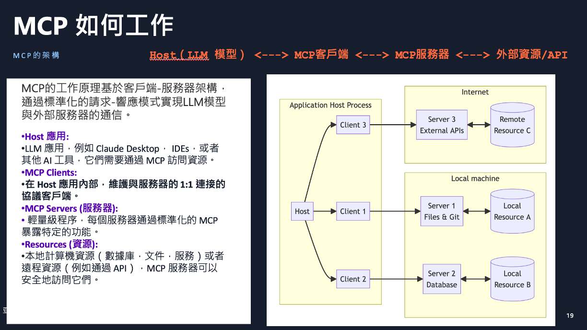  

- 基於AWS的MCP企業架構設計思路  
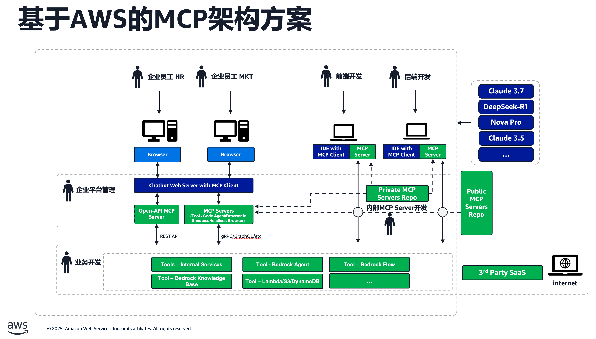

- 本項目提供基於 **Bedrock** 中Nova,Claude等大模型的 ChatBot 交互服務，同時引入 **MCP**，極大增強並延伸 ChatBot 形態產品的應用場景，可支持本地文件系統、數據庫、開發工具、互聯網檢索等無縫接入。引入 MCP 後可以讓大模型與各種現存系統和數據聯通。
  
- **本Demo方案架構**


- **核心組件**
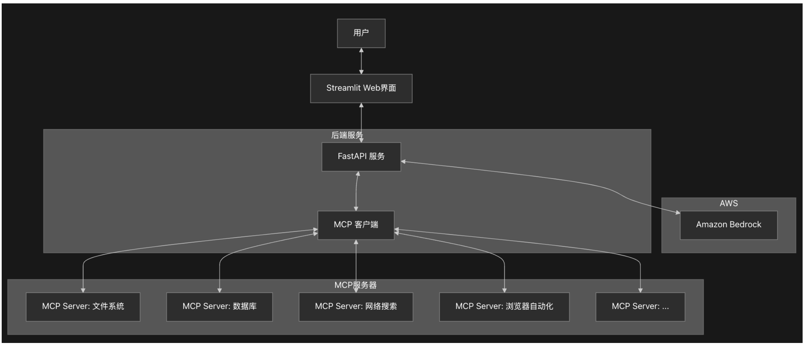  
   1. MCP客戶端(mcp_client.py)
      - 負責管理與多個MCP服務器的連接
      - 處理工具調用和資源訪問
      - 提供工具名稱映射和規範化功能
   2. 聊天客戶端(chat_client.py,chat_client_stream.py)
      - 與Amazon Bedrock API交互
      - 處理用戶查詢和模型響應
      - 支持流式響應和工具調用
   3. 主服務(main.py)
      - 提供FastAPI服務,暴露聊天和MCP管理API
      - 管理用戶會話和MCP服務器配置
      - 處理併發請求和資源清理
   4. Web界面(chatbot.py)
      - 基於Streamlit的用戶界面
      - 允許用戶與模型交互並管理MCP服務器
      - 顯示工具調用結果和思考過程

- **技術架構**
   1. 前後端分離
      - 後端:FastAPI服務提供RESTAPI
      - 前端:Streamlit Web界面
   2. 多用戶支持
      - 用戶會話隔離
      - 支持併發訪問
   3. MCP服務器管理
      - 支持動態添加和移除MCP服務器
      - 全局和用戶特定的MCP服務器配置

- **工作流程**
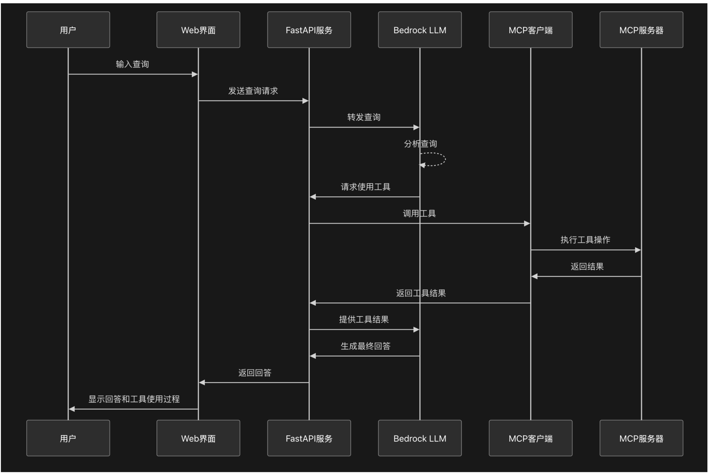
   1. 用戶通過Web界面發送查詢
   2. 後端服務接收查詢並轉發給Bedrock模型
   3. 如果模型需要使用工具,MCP客戶端會調用相應的MCP服務器
   4. 工具調用結果返回給模型,模型生成最終響應
   5. 響應返回給用戶,包括工具調用過程和結果


## 1. 特點：
   - 同時支持Amazon Nova Pro和Claude Sonnet模型
   - 與Anthropic官方MCP標準完全兼容，可以採用同樣的方式，直接使用社區的各種[MCP servers](https://github.com/modelcontextprotocol/servers/tree/main)
   - 將MCP能力和客戶端的解耦，MCP能力封裝在服務端，對外提供API服務，且chat接口兼容openai，方便接入其他chat客戶端
   - 前後端分離，MCP Client和MCP Server均可以部署到服務器端，用戶可以直接使用web瀏覽器通過後端web服務交互，從而訪問LLM和MCP Sever能力和資源  
   - 支持多用戶，用戶session隔離，支持併發訪問。
   - 流式響應
   - 思考過程可視化
   - 工具調用結果展示和Computer Use截圖展示


## 2. 安装步驟
### 2.1. 依賴安装

目前主流 MCP Server 基於 NodeJS 或者 Python 開發實現並運行於用戶 PC 上，因此用戶 PC 需要安裝這些依賴。

### 2.1 NodeJS

NodeJS [下載安裝](https://nodejs.org/en)，本項目已對 `v22.12.0` 版本充分測試。

### 2.2 Python

有些 MCP Server 基於 Python 開發，因此用戶必須安裝 [Python](https://www.python.org/downloads/)。此外本項目代碼也基於 Python 開發，需要安裝環境和依賴。

首先，安裝 Python 包管理工具 uv，具體可參考 [uv](https://docs.astral.sh/uv/getting-started/installation/) 官方指南，本項目已對 `v0.5.11` 版本充分測試。

### 2.3 環境配置
下載克隆該項目後，進入項目目錄創建 Python 虛擬環境並安裝依賴：
```bas
uv sync
```

此時項目目錄的 `.venv` 中就創建好了虛擬環境,activate
```
source .venv/bin/activate
```

- （可選）使用aws cli工具創建一個dynamodb table用於保存user config信息，如果不創建dynamodb，則直接生成user_mcp_config.json保存在conf/目錄下
```bash
aws dynamodb create-table \
    --table-name mcp_user_config_table \
    --attribute-definitions AttributeName=userId,AttributeType=S \
    --key-schema AttributeName=userId,KeyType=HASH \
    --billing-mode PAY_PER_REQUEST 
```
### 2.4 配置編輯（海外區使用Bedrock）
> Tips: 如何需要配置多個賬號ak/sk, 使用輪詢機制，可以在conf/目錄下增加一個`credential.csv`, 列名分別為**ak**，**sk**， 填入多個ak/sk即可，例如: 
  
| ak | sk |  
| ----- | ----- |  
| ak 1 | sk 1 |  
| ak 2 | sk 2 |  

運行以下命令創建.env 文件， **請修改AWS_ACCESS_KEY_ID,AWS_SECRET_ACCESS_KEY,AWS_REGION等信息之後再運行**  

```bash
cat << EOF > .env
AWS_ACCESS_KEY_ID=(可選，如果有credential.csv則不需要)
AWS_SECRET_ACCESS_KEY=(可选)<your-secret-key>
AWS_REGION=<your-region>
LOG_DIR=./logs
CHATBOT_SERVICE_PORT=8502
MCP_SERVICE_HOST=127.0.0.1
MCP_SERVICE_PORT=7002
API_KEY=123456
MAX_TURNS=200
ddb_table=mcp_user_config_table
EOF
```

備注：該項目用到 **AWS Bedrock Nova/Claude** 系列模型，因此需要註冊並獲取以上服務訪問密鑰。


## 3. 運行

### 3.1 該項目包含1個後端服務和一個streamlit 前端， 前後端通過rest api對接：
- **Chat 接口服務（Bedrock+MCP）**，可對外提供 Chat 接口、同時托管多個 MCP server、支持歷史多輪對話輸入、響應內容附加了工具調用中間結果、暫不支持流式響應
- **ChatBot UI**，跟上述 Chat 接口服務通信，提供多輪對話、管理 MCP 的 Web UI 演示服務

### 3.2 Chat 接口服務（Bedrock+MCP）
- 接口服務可以對外提供給獨立API，接入其他chat客戶端, 實現服務端MCP能力和客戶端的解耦
- 可以通過http://{ip}:7002/docs#/查看接口文檔.
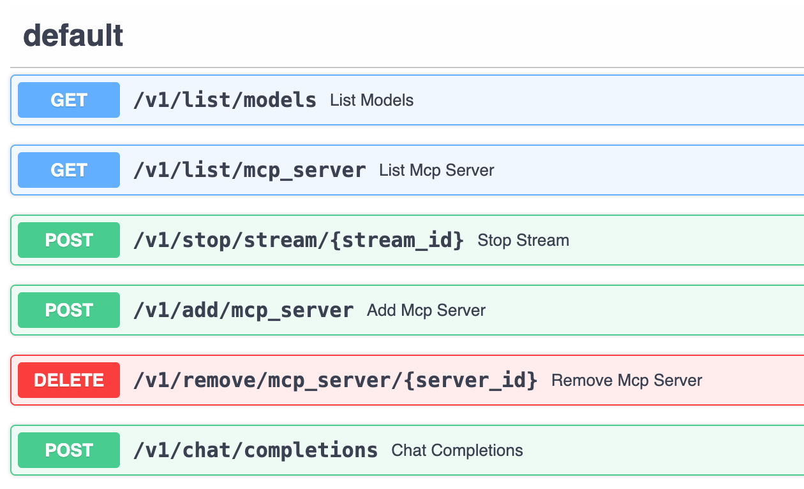

- 編輯配置文件 `conf/config.json`，該文件預設了要啓動哪些 MCP server，可以編輯來添加或者修改 MCP server 參數。
- 每個 MCP server 的參數規範，可參考如下示例： 
```
"db_sqlite": {
    "command": "uvx",
    "args": ["mcp-server-sqlite", "--db-path", "./tmp/test.db"],
    "env": {},
    "description": "DB Sqlite CRUD - MCP Server",
    "status": 1
}
```

- 啓動服務：
```bash
bash start_all.sh
```

- 停止服務:
```bash
bash stop_all.sh
```

- 待啓動後，可查看日誌 `logs/start_mcp.log` 確認無報錯，然後可運行測試腳本檢查 Chat 接口：
```bash
# 腳本使用 Bedrock 的 Amazon Nova-lite 模型，也可更換其它
# 預設使用123456作為API key, 請根據實際設置更改
curl http://127.0.0.1:7002/v1/chat/completions \
  -H "Content-Type: application/json" \
  -H "Authorization: Bearer 123456" \
  -H "X-User-ID: user123" \
  -d '{
    "model": "us.amazon.nova-pro-v1:0",
    "mcp_server_ids":["local_fs"],
    "stream":true,
    "keep_session":false,
    "messages": [
      {
        "role": "user",
        "content": "list files in current dir"
      }
    ]
  }'
```
- 如果keep_session:true表示在伺服器端保持session，服務器會保留歷史消息和工具調用，客戶端只需傳入最新一輪的user message即可

### 3.3  (🚀 New) React UI
- 🚀 基於Next.js 15和React 18構建的現代化前端，支持Dark/Light模式
- 🎨 使用Tailwind CSS和Shadcn UI組件庫實現美觀的用戶界面
- 🔄 實時流式響應，提供流暢的對話體驗
- 🧠 支持"思考"模式，展示模型的推理過程
- 🛠️ MCP服務器管理功能，支持添加和配置服務器
- 👤 用戶會話管理，保持對話上下文
- 📊 可視化工具使用結果，包括圖像顯示
- 📱 支持多模態輸入，包括圖片，pdf，文檔等附件上傳
- [安裝步驟](react_ui/README.md)
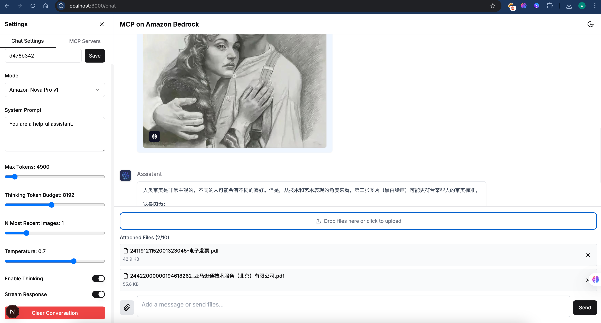
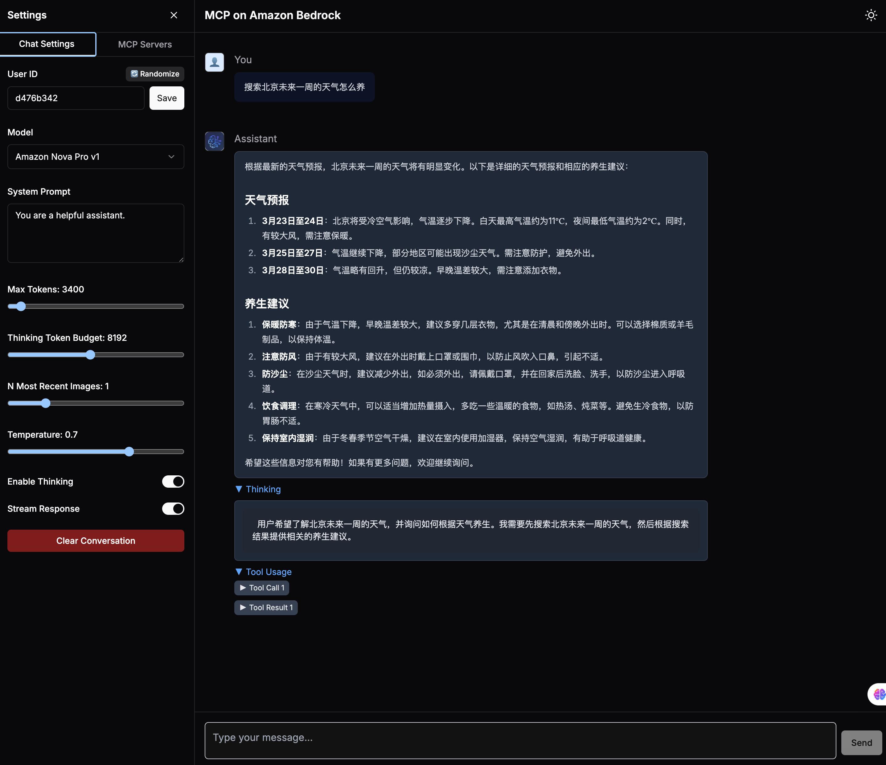


#### ChatBot UI 
待啓動後，可查看日誌 `logs/start_chatbot.log` 確認無報錯，然後瀏覽器打開[服務地址](http://localhost:8502/)，即可體驗 MCP 增強後的 Bedrock 大模型 ChatBot 能力。
由於已內置了文件系統操作、SQLite 數據庫等 MCP Server，可以嘗試連續提問以下問題進行體驗：

```
show all of tables in the db
how many rows in that table
show all of rows in that table
save those rows record into a file, filename is rows.txt
list all of files in the allowed directory
read the content of rows.txt file
```

### 3.4. 添加 MCP Server
當前可以通過兩種方式來添加 MCP Server：
1. 預置在 `conf/config.json`，每次重新啓動 Chat 接口服務就會加載配置好的 MCP Server 
2. 通過 ChatBot UI 來添加 MCP Server，表單提交 MCP Server 參數即可，僅當前生效、服務重啓後失效  
下面演示如何通過 ChatBot UI 添加 MCP Server，這裡以 Web Search 供應商 [Exa](https://exa.ai/) 為例，開源社區已有針對它的 [MCP Server](https://github.com/exa-labs/exa-mcp-server) 可用。  
首先，前往 [Exa](https://exa.ai/) 官網註冊賬號，並獲取 API Key。  
然後點擊【添加 MCP Server】，在彈出菜單中填寫如下參數並提交即可：  
- 方式1，直接添加MCP json 配置文件(與Anthropic官方格式相同)   
```json
{
  "mcpServers": {
    "exa": {
      "command": "npx",
      "args": ["-y","exa-mcp-server"],
      "env": {
        "EXA_API_KEY": "your-api-key-here"
      }
    }
  }
}
```
- 方式2，按字段添加 

此時在已有 MCP Server 列表中就可以看到新添加項，勾選即可啓動該 MCP Server。

## 4. CDK安装（新增）
[README](cdk/README.me)

## 5 Demo cases
### 5.1.使用MCP操作Browser瀏覽器 
- 在chatbot界面上添加這個json文件,注意：這個[browser use](https://github.com/vinayak-mehta/mcp-browser-use)server默認啓動有頭模式的瀏覽器，因此適合在本地電腦部署的demo中，如果在服務器端部署，請在提示詞里加一句`use headless is true to initialize the browser`
**注意** 第一次運行時，需要在服務安裝對應的依賴包 `sudo apt-get install libgbm1`  
```json
{ "mcpServers": 
	{ "mcp-browser": 
		{ "command": "uvx", 
        "args": ["mcp-browser-use"],
        "env": {},
        "description": "mcp-browser"
		} 
	} 
}
```  

- **New added 20250331** 使用MS官方[playwright](https://mcp.so/server/playwright-mcp/microsoft):   
**注意** 如果需要無頭模式則添加"--headless"參數，第一次運行時，需要在服務安裝對應的依賴包 `npx playwright install chrome`  
```json
{
  "mcpServers": {
    "playwright": {
      "command": "npx",
      "args": [
        "@playwright/mcp@latest",
        "--headless"
      ]
    }
  }
}
```

- test 1, 在chatbot界面中，勾選mcp-browser和local file system 2個server  
輸入任務：`幫我整理一份關於小米SU7 ultra的介紹，包括性能，價格，特色功能，圖文並茂，並製作成精美的HTML保存到本地目錄中.如果引用了其他網站的圖片，確保圖片真實存在，並且可以訪問。`  
[視頻demo](https://mp.weixin.qq.com/s/csg7N8SHoIR2WBgFOjpm6A)  
[最終輸出文件示例](docs/xiaomi_su7_ultra_intro.html)  
  - 如果第一次運行可能需要額外安裝一些軟件，請跟進tool call 返回的信息提示安裝即可  

- test 2, 在chatbot界面中，勾選exa,mcp-browser和local file system 3個server, 會結合搜索引擎，瀏覽器共同獲取信息和圖片，形成更豐富的報告
輸入任務：`我想要一份特斯拉股票的全面分析，包括：概述：公司概況、關鍵指標、業績數據和投資建議財務數據：收入趨勢、利潤率、資產負債表和現金流分析市場情緒：分析師評級、情緒指標和新聞影響技術分析：價格趨勢、技術指標和支撐/阻力水平資產比較：市場份額和與主要競爭對手的財務指標對比價值投資者：內在價值、增長潛力和風險因素投資論點：SWOT 分析和針對不同類型投資者的建議。 並製作成精美的HTML保存到本地目錄中。如果引用了其他網站的圖片，確保圖片真實存在，並且可以訪問。 你可以使用mcp-browser和exa search去獲取盡可能豐富的實時數據和圖片。`   
[最終輸出文件示例](docs/tesla_stock_analysis.html)  

- **時序圖1:使用Headless Browser 的 MCP Server**
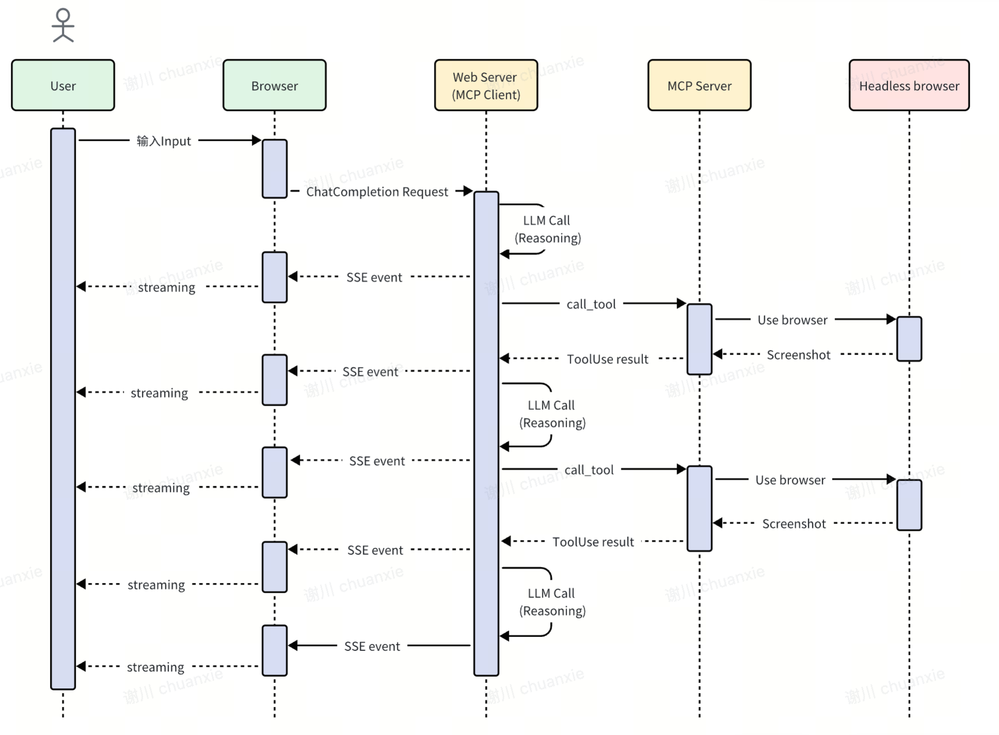  

### 5.2 使用MCP Computer Use 操作 EC2 remote desktop
- 在另外一個目錄中安裝下載remote-computer-use
```bash
git clone https://github.com/aws-samples/aws-mcp-servers-samples.git
```
- 需要提前安裝一台EC2實例，並配置VNC遠程桌面。安裝步驟請參考[說明](https://github.com/aws-samples/aws-mcp-servers-samples/blob/main/remote_computer_use/README.md)
- 環境配置好之後，在MCP demo客戶端配置如下：
```json
{
    "mcpServers": {
        "computer_use": {
            "command": "uv",
            "env": {
                "VNC_HOST":"",
                "VNC_PORT":"5901",
                "VNC_USERNAME":"ubuntu",
                "VNC_PASSWORD":"",
                "PEM_FILE":"",
                "SSH_PORT":"22",
                "DISPLAY_NUM":"1"
            },
            "args": [
                "--directory",
                "/absolute_path_to/remote_computer_use",
                "run",
                "server_claude.py"
            ]
        }
    }
}
```
- 使用Computer Use推薦用Claude 3.7模型，並添加如下system prompt  

```plaintext
You are an expert research assistant with deep analytical skills.
you have capability:
<SYSTEM_CAPABILITY>
* You are utilising an Ubuntu virtual machine using Linux architecture with internet access.
* You can feel free to install Ubuntu applications with your bash tool. Use curl instead of wget.
* When viewing a page it can be helpful to zoom out so that you can see everything on the page.  Either that, or make sure you scroll down to see everything before deciding something isn't available.
* When using your computer function calls, they take a while to run and send back to you.  Where possible/feasible, try to chain multiple of these calls all into one function calls request.
* You can double click to open firefox
</SYSTEM_CAPABILITY>
<IMPORTANT>
  * Don't assume an application's coordinates are on the screen unless you saw the screenshot. To open an application, please take screenshot first and then find out the coordinates of the application icon. 
  * When using Firefox, if a startup wizard or Firefox Privacy Notice appears, IGNORE IT.  Do not even click "skip this step".  Instead, click on the address bar where it says "Search or enter address", and enter the appropriate search term or URL there. Maximize the Firefox browser window to get wider vision.
  * If the item you are looking at is a pdf, if after taking a single screenshot of the pdf it seems that you want to read the entire document instead of trying to continue to read the pdf from your screenshots + navigation, determine the URL, use curl to download the pdf, install and use pdftotext to convert it to a text file, and then read that text file directly with your StrReplaceEditTool.
  * After each step, take a screenshot and carefully evaluate if you have achieved the right outcome. Explicitly show your thinking: "I have evaluated step X..." If not correct, try again. Only when you confirm a step was executed correctly should you move on to the next one.
</IMPORTANT>
```   

- **时序图:使用Computer Use 操作 EC2 Remote Desktop**  


### 5.3.使用Sequential Thinking + Search 做 Deep Research (主要針對Nova/Claude 3.5模型, Claude 3.7不需要)
- 同時啓用 websearch(參考上面的EXA配置)和 [Sequential Thinking MCP Server](https://github.com/modelcontextprotocol/servers/tree/main/src/sequentialthinking)，目前已經預置了Sequential Thinking MCP Server在配置文件中, 啓動後可以看到server名稱是cot。  
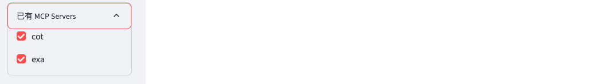
- Sequential Thinking提供通過動態的結構化思維過程和反思，通過工具調用的促使模型按工具輸入的要求進行結構化輸出推理鏈條。
- EXA Search 同時提供關鍵詞和向量檢索搜索網絡知識，並返回頁面的上的詳細內容。
- 測試問題
```
1. use search tool and sequential thinking to make comparison report between different agents frameworks such as autogen, langgraph, aws multi agents orchestrator
2. use sequential thinking and search tool to make me a travel plan to visit shanghai between 3/1/2025 to 3/5/2025. I will departure from Beijing
3. use sequential thinking to research what the key breakthroughs and future impact of deepseek r1

```
- 效果一览
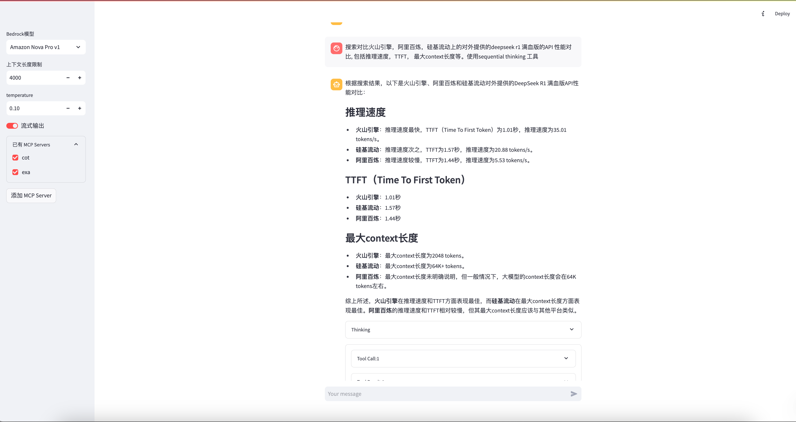
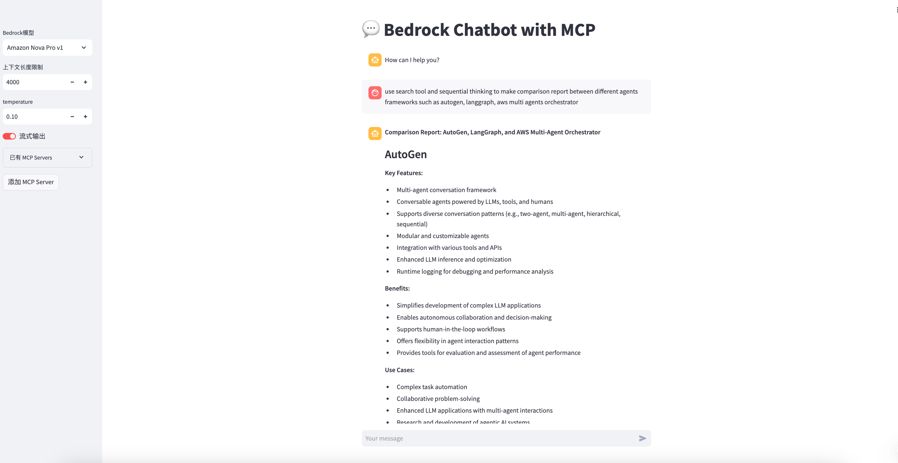

- **時序圖:使用Search API 的 MCP Server**  
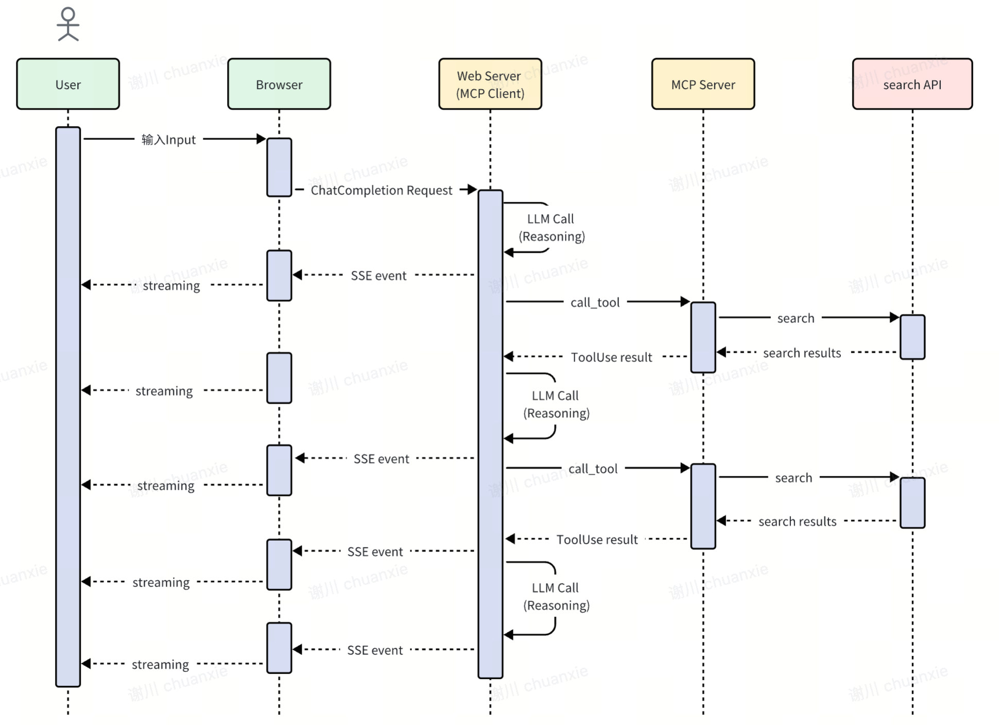  

###  5.3. 使用Amazon Knowledge Base
先在Bedrock console中创建或者使用已有的Bedrock，记下Knowledge Base Id  
Clone [AWS Knowledge Base Retrieval MCP Server](https://github.com/modelcontextprotocol/servers)到本地，并用[assets/aws-kb-retrieval-server/index.ts)](assets/aws-kb-retrieval-server/index.ts)下的文件替换 `src/aws-kb-retrieval-server/index.ts`里的文件。  
> 新文件把knowledgeBaseId通过环境变量指定，无须再通过对话传入。  

在新clone的servers目录下用如下命令打包  
```sh
docker build -t mcp/aws-kb-retrieval:latest -f src/aws-kb-retrieval-server/Dockerfile . 
```

然后在chatbot界面上添加这个json文件，注意env中的字段需要替换成自己的账号信息，以及Knowledge Base Id   
```json
{
  "mcpServers": {
    "aws-kb-retrieval": {
      "command": "docker",
      "args": [ "run", "-i", "--rm", "-e", "AWS_ACCESS_KEY_ID", "-e", "AWS_SECRET_ACCESS_KEY", "-e", "AWS_REGION", "-e", "knowledgeBaseId", "mcp/aws-kb-retrieval:latest" ],
      "env": {
        "AWS_ACCESS_KEY_ID": "YOUR_ACCESS_KEY_HERE",
        "AWS_SECRET_ACCESS_KEY": "YOUR_SECRET_ACCESS_KEY_HERE",
        "AWS_REGION": "YOUR_AWS_REGION_HERE",
        "knowledgeBaseId":"The knowledage base id"
      }
    }
  }
}
```

## 6. Awsome MCPs
- AWS MCP Servers Samples https://github.com/aws-samples/aws-mcp-servers-samples
- https://github.com/punkpeye/awesome-mcp-servers
- https://github.com/modelcontextprotocol/servers
- https://www.aimcp.info/en
- https://github.com/cline/mcp-marketplace
- https://github.com/xiehust/sample-mcp-servers
- https://mcp.composio.dev/
- https://smithery.ai/
- https://mcp.so/

## 9. [LICENSE](./LICENSE)
