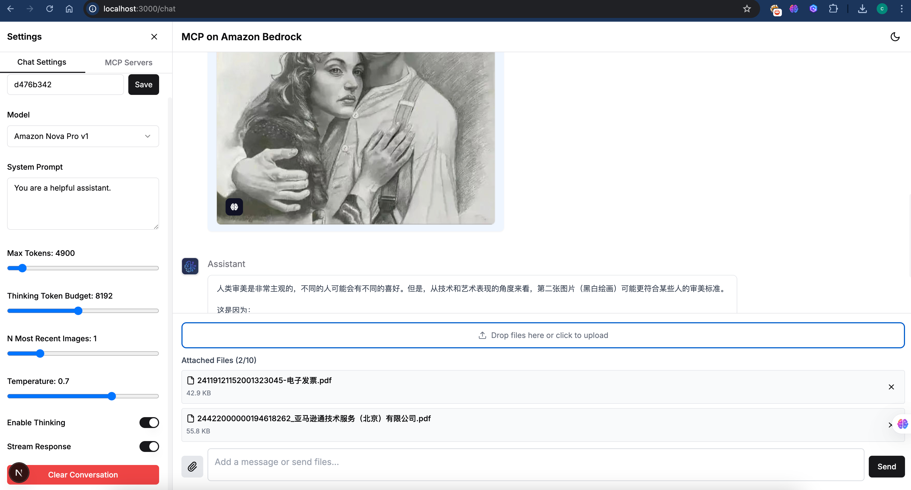
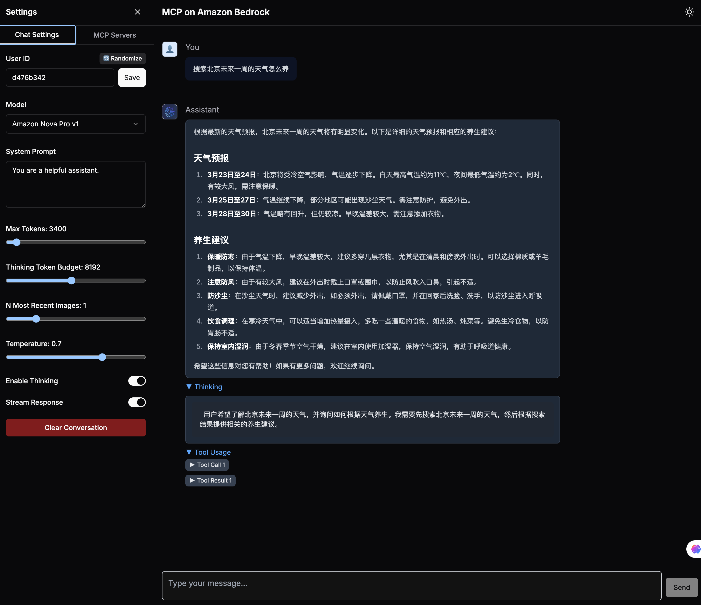

# MCP on Amazon Bedrock - Next.js UI

这是一个使用Next.js框架构建的React前端应用，用于与Amazon Bedrock上的MCP服务进行交互。该应用提供了一个现代化、响应式的用户界面，支持与各种大语言模型进行对话，并可以配置和管理MCP服务器。

## 功能特点
- 🚀 基于Next.js 14和React 18构建的现代化前端，支持Dark/Light模式
- 🎨 使用Tailwind CSS和Shadcn UI组件库实现美观的用户界面
- 🔄 实时流式响应，提供流畅的对话体验
- 🧠 支持"思考"模式，展示模型的推理过程
- 🛠️ MCP服务器管理功能，支持添加和配置服务器
- 👤 用户会话管理，保持对话上下文
- 📊 可视化工具使用结果，包括图像显示
- 📱 响应式设计，适配各种设备尺寸



## 技术栈

- **前端框架**: Next.js 15 (App Router)
- **UI库**: React 18, Tailwind CSS, Shadcn UI
- **状态管理**: React Context API + Zustand
- **API通信**: Fetch API, Server Actions
- **实时通信**: Server-Sent Events (SSE)

## 快速开始

### 前提条件

- Node.js 22.x 或更高版本, 安装参考：https://nodejs.org/en/download   
- Linux下安装命令
```bash
# Download and install nvm:
curl -o- https://raw.githubusercontent.com/nvm-sh/nvm/v0.40.2/install.sh | bash

# in lieu of restarting the shell
\. "$HOME/.nvm/nvm.sh"

# Download and install Node.js:
nvm install 22

# Verify the Node.js version:
node -v # Should print "v22.14.0".
nvm current # Should print "v22.14.0".

# Verify npm version:
npm -v # Should print "10.9.2".
```

### 安装步骤

1. 克隆仓库之后
```bash
cd demo_mcp_on_amazon_bedrock/react_ui
```

2. 安装依赖
```bash
npm install
```
- 安装pm2工具
```bash
npm -g install pm2
```

3. 创建环境变量文件
```bash
cp .env.example .env.local
```

4. 编辑`.env.local`文件，添加必要的环境变量, `API_KEY`跟后端MCP后台服务，在项目根目录中.env定义的一致就可以
```
NEXT_PUBLIC_API_KEY=123456
NEXT_PUBLIC_MCP_BASE_URL=http://127.0.0.1:7002
```

5. 编译前端
```bash
npm run build
```

6. 使用pm2在后台启动前端
```bash
pm2 start pm2run.js
```

- 其他参考命令
```bash
#重启前端
pm2 restart all
#stop前端
pm2 stop all
#查看日志
pm2 logs --lines 100
```

7. 在浏览器中访问 [http://localhost:3000/chat](http://localhost:3000/chat)

## 项目结构

```
/
├── app/                  # Next.js App Router
│   ├── api/              # API路由
│   ├── chat/             # 聊天页面
│   └── page.tsx          # 首页
├── components/           # React组件
│   ├── chat/             # 聊天相关组件
│   ├── mcp/              # MCP服务器相关组件
│   ├── ui/               # UI组件库
│   └── providers/        # 上下文提供者
├── lib/                  # 工具函数和服务
│   ├── api/              # API客户端
│   ├── hooks/            # 自定义Hooks
│   ├── store/            # 状态管理
│   └── utils/            # 工具函数
├── public/               # 静态资源
└── styles/               # 全局样式
```
